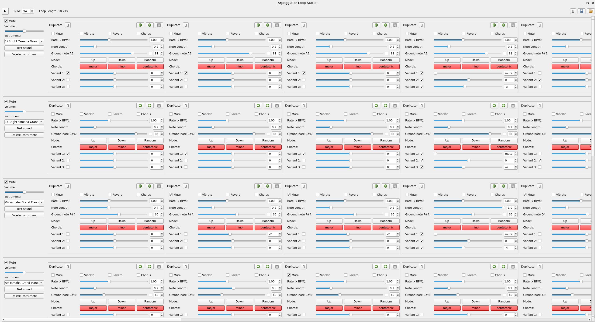

# Loopeggiator

Loop station meets arpeggiators in python.

This is just a small test project to try PyQt6 and the first time programming with music software in general.

See requirements.txt for needed packages for installation.

To run Loopeggiator: python3 loopeggiator.py 

## Ideas

- [x] One loop should have length max(all rows) (merger les arpeggios de TOUT, jouer un seul loop.)
- [x] An arp should be mutable (i mean silencable) so we can have pauses
- [x] Save & load
- [X] Remove Arp & Instrument row 
- [X] Total volume
- [x] Effets de son
- [x] Adjust front end so it shows where we are on the beat atm
- [x] Report
- [x] Move arps left and right
- [x] Duplicate
- [x] Variant option 0 to play a silent sound (pauses in arpeggios possible)
- [x] Needed packages for program installation? (requirements.txt?)
- [x] No mode (all buttons deactivated)
- [x] Mute whole row by key press (1-0, [Y/Z], U, I, O, P for all 16 channels)

## Bugs

- [x] Volume 
- [x] duplicate: variant ticks
- [x] Deactivate chords Shortcuts if not active (they should recognize if it is their mode)
- [ ] Effects just apply on the ground note
- [ ] Rate: Spinbox does not work
- [ ] Rate: Scrolling makes it impossible to change the rate

## Optional

- [ ] Undo/Redo / Ctrl+Z/Ctrl+Shift+Z
- [ ] Small arp view (make height smaller if row not selectedand replace by some other thing)
- [ ] Small arp view (make width smaller)
- [ ] Zoom?
- [ ] Arp volume?
- [x] Change soundfont?
- [x] Limit to max_rows rows (16)
- [x] Vertical scrolling, scrolling in general
